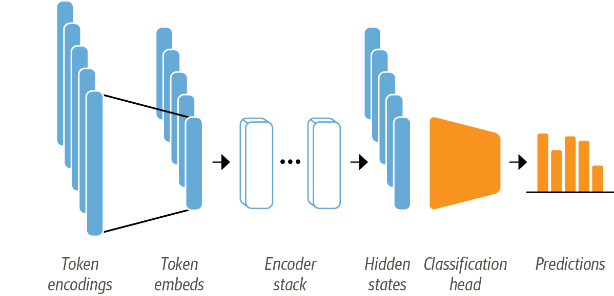

# DistilBERT-in-emotions-classification-NLP-

In this repo you can find Text classification using DistilBERT and other Natural lanuguage processing techniques like feature extraction the use them as 
input for Logistic Regression model. 

# Dataset: Emotion dataset to classify the text into 6 catiguries [anger, disgust, fear, joy, sadness, surprise]

  

